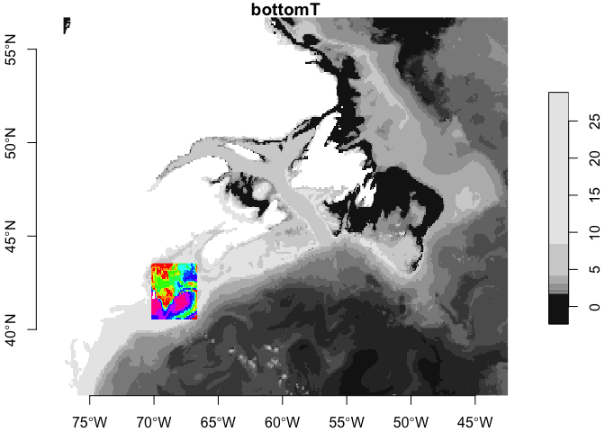

copernicus
================

# copernicus

Provides download and access to
[Copernicus](https://marine.copernicus.eu/) marine datasets.

### Requirements

#### Python

-   [motuclient](https://help.marine.copernicus.eu/en/articles/4796533-what-are-the-motu-client-motuclient-and-python-requirements#h_253e379790)

#### R

-   [R v4+](https://www.r-project.org/)
-   [rlang](https://CRAN.R-project.org/package=rlang)
-   [dplyr](https://CRAN.R-project.org/package=dplyr)
-   [ncdf4](https://CRAN.R-project.org/package=ncdf4)
-   [sf](https://CRAN.R-project.org/package=sf)
-   [stars](https://CRAN.R-project.org/package=stars)
-   [readr](https://CRAN.R-project.org/package=readr)

#### Copernicus Credentials

You have to get your own credentials from
[Copernicus](https://resources.marine.copernicus.eu/registration-form) -
a user name and password. These can be stored in your `~/.Rprofile` file
which is just a hidden text file that is loaded and run when you
instance of R starts.

    options(copernicus = list(username = "my_user_name", 
                              password = "my_password",
                              python_app = "python3"))

If you have a non-boring install of python then be sure to set
python_app to your own need.

### Installation

    remotes::install_github("oceanhackweek/ohw22-proj-xyzt",
                            subdir = "package/copernicus")

## Downloading

As minimum you should be able to down the default (for Northwest
Atlantic) region.

``` r
library(stars)
```

    ## Loading required package: abind

    ## Loading required package: sf

    ## Linking to GEOS 3.10.2, GDAL 3.5.0, PROJ 9.0.0; sf_use_s2() is TRUE

``` r
library(copernicus)
library(xyzt)

x <- fetch_copernicus(out_path = "~/copernicus-test.nc") 
x
```

    ## stars object with 2 dimensions and 11 attributes
    ## attribute(s):
    ##               Min.     1st Qu.       Median        Mean     3rd Qu.      Max.
    ## mlotst    6.408887 10.52888627 10.528886274 11.76641723 10.83407138 43.031100
    ## siconc          NA          NA           NA         NaN          NA        NA
    ## thetao    6.707816 13.70705283 19.242866300 19.61059952 26.67351298 30.345988
    ## usi             NA          NA           NA         NaN          NA        NA
    ## sithick         NA          NA           NA         NaN          NA        NA
    ## bottomT  -2.365703  1.80556659  1.960844770  3.54582725  3.61983094 28.859127
    ## vsi             NA          NA           NA         NaN          NA        NA
    ## vo       -1.171300 -0.07995849  0.004882962  0.02105618  0.09338664  1.585742
    ## uo       -1.091342 -0.01953185  0.061647389  0.10684317  0.15991699  1.961119
    ## so        2.354503 31.86590164 33.922849176 33.46376564 35.65019681 37.305826
    ## zos      -1.055330 -0.66805017 -0.457777642 -0.38854978 -0.22888882  1.065096
    ##            NA's
    ## mlotst    34248
    ## siconc   100845
    ## thetao    34248
    ## usi      100845
    ## sithick  100845
    ## bottomT   34248
    ## vsi      100845
    ## vo        34248
    ## uo        34248
    ## so        34248
    ## zos       34248
    ## dimension(s):
    ##   from  to   offset      delta refsys point values x/y
    ## x    1 415 -77.0417  0.0833333 WGS 84    NA   NULL [x]
    ## y    1 243  56.7083 -0.0833333 WGS 84    NA   NULL [y]

You can read that file later using `read_copernicus(filename)` like
this.

``` r
x <- read_copernicus("~/copernicus-test.nc")
```

### Extracting point data

Since have a stars object, you can use
`stars::st_extract(x, at = your_points)`. Let’s borrow the Gulf of Maine
points from the [xyzt package](https://github.com/BigelowLab/xyzt)

``` r
points <- xyzt::read_gom() |>
  xyzt::as_POINT()

vars <- stars::st_extract(x, at = points)
vars
```

    ## Simple feature collection with 5 features and 11 fields
    ## Geometry type: POINT
    ## Dimension:     XY
    ## Bounding box:  xmin: -70.17 ymin: 40.5 xmax: -66.59 ymax: 43.5
    ## Geodetic CRS:  WGS 84
    ##     mlotst siconc   thetao usi sithick   bottomT vsi          vo          uo
    ## 1 10.52889     NA 19.97238  NA      NA  8.210059  NA  0.03112888  0.04577776
    ## 2 10.52889     NA 18.30461  NA      NA  8.298685  NA -0.14770959 -0.01342814
    ## 3 10.52889     NA 18.16837  NA      NA  9.178350  NA -0.01525925  0.06469924
    ## 4 10.52889     NA 19.71017  NA      NA 10.333415  NA -0.17212439 -0.03357036
    ## 5 10.52889     NA 21.44826  NA      NA 12.855953  NA -0.04516739 -0.01403851
    ##         so        zos             geometry
    ## 1 32.28706 -0.4583880 POINT (-70.17 42.81)
    ## 2 32.25501 -0.4449599 POINT (-69.22 43.17)
    ## 3 32.05206 -0.4657125  POINT (-67.87 43.5)
    ## 4 31.72246 -0.4217658 POINT (-66.59 41.09)
    ## 5 33.20719 -0.4528947  POINT (-69.24 40.5)

### Extracting data within a bounding box

``` r
bbox <- points |>
  xyzt::as_BBOX()

sub <- x[bbox]
sub
```

    ## stars object with 2 dimensions and 11 attributes
    ## attribute(s):
    ##                Min.     1st Qu.      Median        Mean     3rd Qu.       Max.
    ## mlotst    6.7140724 10.52888627 10.52888627 10.51066627 10.52888627 11.7496267
    ## siconc           NA          NA          NA         NaN          NA         NA
    ## thetao   17.4615619 18.39616077 19.31318095 19.37997168 20.19504379 22.9182714
    ## usi              NA          NA          NA         NaN          NA         NA
    ## sithick          NA          NA          NA         NaN          NA         NA
    ## bottomT   3.5890683  8.63487656  9.31165503 10.58164630 11.70235299 22.9263283
    ## vsi              NA          NA          NA         NaN          NA         NA
    ## vo       -0.2185125 -0.10315256 -0.05920591 -0.05706308 -0.01709037  0.1074252
    ## uo       -0.1416059  0.01281777  0.05798517  0.06117010  0.11474960  0.2258370
    ## so       31.1853389 32.02917567 32.23822745 32.24748500 32.53120515 33.6893826
    ## zos      -0.5069124 -0.46266060 -0.44892727 -0.44514682 -0.43092135 -0.3927732
    ##          NA's
    ## mlotst     87
    ## siconc   1628
    ## thetao     87
    ## usi      1628
    ## sithick  1628
    ## bottomT    87
    ## vsi      1628
    ## vo         87
    ## uo         87
    ## so         87
    ## zos        87
    ## dimension(s):
    ##   from  to   offset      delta refsys point values x/y
    ## x   83 126 -77.0417  0.0833333 WGS 84    NA   NULL [x]
    ## y  159 195  56.7083 -0.0833333 WGS 84    NA   NULL [y]

``` r
n <- 11
plot(x['bottomT'], axes = TRUE, reset = FALSE)
plot(sub['bottomT'], add = TRUE, 
     col = rainbow(n-1),
     main = NULL)
```

<!-- -->

### Look Up Table (lut)

The variable names are a bit cryptic (at least to me) so we provide a
look-up table that associates the variable name with other information
available from the source.

``` r
lut <- copernicus::read_lut()
print(lut, n = nrow(lut))
```

    ## # A tibble: 11 × 3
    ##    name    longname                            units    
    ##    <chr>   <chr>                               <chr>    
    ##  1 mlotst  Density ocean mixed layer thickness m        
    ##  2 siconc  Ice concentration                   1        
    ##  3 thetao  Temperature                         degrees_C
    ##  4 usi     Sea ice eastward velocity           m s-1    
    ##  5 sithick Sea ice thickness                   m        
    ##  6 bottomT Sea floor potential temperature     degrees_C
    ##  7 vsi     Sea ice northward velocity          m s-1    
    ##  8 vo      Northward velocity                  m s-1    
    ##  9 uo      Eastward velocity                   m s-1    
    ## 10 so      Salinity                            1e-3     
    ## 11 zos     Sea surface height                  m
